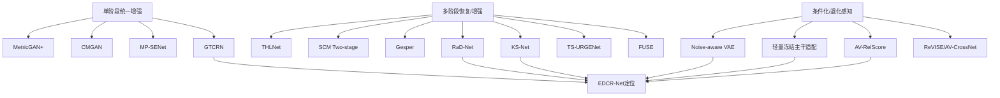
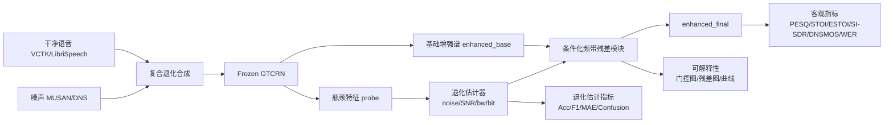

# EDCR-Net 学术现状、实验设计与创新性评估报告

## 执行摘要

围绕“面向复合退化的显式退化建模与条件化频带残差语音增强方法”，近五年的学术主线已经很清楚：一条线是继续做高性能单阶段增强，如 MetricGAN+、CMGAN、MP-SENet、GTCRN 等；另一条线则明显转向**面向复合失真的多阶段恢复**，代表性节点包括 ICASSP 2024 Speech Signal Improvement Challenge、URGENT Challenge 以及随之出现的 TS-URGENet、FUSE、USEMamba、KS-Net、RaD-Net 等系统。这说明“多失真统一处理”“恢复—增强分阶段”“频带/子任务专门化”已经成为活跃方向，但多数方法仍然是**架构上按失真类型分工**，而不是**在推理时显式估计当前样本的退化状态，再做轻量条件补偿**。citeturn7academia3turn17academia3turn16academia1turn16academia3turn16academia0turn8academia2turn0academia1

就你当前的 EDCR-Net 原型而言，它已经具备一个比较清晰的研究特征：以**冻结 GTCRN**作为基础增强主干，从其 **dpgrnn2 bottleneck 统计特征**中估计噪声存在性、SNR、带宽类别和位深，再由轻量残差模块执行条件化修复；按照项目说明，它在不破坏官方基线的前提下保持 bit-exact，一共只新增 4,169 个参数，且当前测试覆盖为 73/73 通过。这个设计与纯粹“重新训练一个更大的增强器”不同，更接近**显式退化诊断 + 受控残差二次修复**。fileciteturn0file0 结合 GTCRN 官方实现给出的超低计算量定位，这种“冻结主干 + 极轻量补偿头”的路线在语音增强文献中仍然不算拥挤。citeturn10view0

因此，若从**学术新颖性**而不是工程完成度来评价，EDCR-Net 当前最强的创新点不是“两阶段”本身，也不是“残差”本身，而是这几个元素的组合：**冻结轻量骨干、瓶颈特征探测、显式复合退化估计、条件化频带残差、保护性融合**。这套组合在现有公开工作中有明显邻近物，但尚未看到高度同构的成熟范式。我的结论是：**当前版本的新颖性评级为“中”**；如果你补齐未知退化泛化、Oracle 标签上界、瓶颈可探测性、频带门控可解释性以及跨数据集验证，能够提升到**“中偏高”**。citeturn13academia0turn27academia1turn8academia2turn16academia1turn14academia0

## 研究现状综述

从 2021 到 2026 年，语音增强研究已经从“单一加性噪声抑制”逐步扩展到“复合退化统一恢复”。一方面，MetricGAN+、CMGAN、MP-SENet、GTCRN 等方法持续优化感知损失、相位恢复和低复杂度部署；另一方面，SSI 2024 与 URGENT 等挑战把**通信失真、带宽扩展、去混响、去削波、丢包修复、残余伪影抑制**等问题放到统一框架下考察，推动了多阶段与多分支方法的发展。citeturn9academia2turn2academia2turn27academia2turn10view0turn7academia3turn17academia3turn30academia0

下面这张图可以概括当前与你题目最接近的研究谱系。

下表按你要求的类别做了压缩式综述。这里“显式退化建模”的判断标准是：论文是否**明确估计或使用可命名的退化变量**，例如噪声存在、SNR、带宽、位深、可靠性分数，而不是仅仅使用隐式注意力或统一网络。表中“是否频带选择性”“是否冻结主干”等列，是基于原文方法描述做的分析性归纳。citeturn13academia0turn14academia0turn21academia3

| 类别 | 方法名 | 年份 / 会议或期刊 | 核心技术 | 显式退化建模 | 频带选择性 | 冻结主干 | 可解释性 / 可视化 |
|---|---|---|---|---|---|---|---|
| 轻量主干基线 | GTCRN citeturn10view0 | 2024 / ICASSP | 分组时域卷积 + DPGRNN，48.2K 参数级别超轻量增强 | 否 | 部分，ERB 压缩但非条件化 | 否 | 有复杂度与性能表 |
| 感知优化单阶段 | MetricGAN+ citeturn9academia2 | 2021 / Interspeech | 用可感知指标代理训练增强器 | 否 | 否 | 否 | 有指标导向解释 |
| 感知优化单阶段 | CMGAN citeturn2academia2turn33view0 | 2022 / Interspeech，后续扩展到 TASLP | Conformer + Metric-GAN，复频谱建模 | 否 | 部分，时频联合建模 | 否 | 有架构与对比图 |
| 幅相并行增强 | MP-SENet citeturn27academia2turn33view1 | 2023 / arXiv 长文 | 幅度与相位并行显式估计，扩展到降噪/去混响/带宽扩展 | 否 | 部分，时频 Transformer | 否 | 有显式幅相分离解释 |
| 两阶段轻量增强 | THLNet citeturn27academia1 | 2023 / arXiv | 粗粒度全频掩膜 + 细粒度低频修复 | 否 | 是 | 否 | 两阶段功能清晰 |
| 两阶段全频增强 | SCM Two-stage citeturn5academia3 | 2022 / arXiv | 先提到高 SNR 状态，再优化实虚掩膜 | 否 | 是，谱压缩强调低中频 | 否 | 有明确阶段解释 |
| 恢复—增强串联 | Gesper citeturn0academia3 | 2023 / SSI 系统论文 | 先 restoration，再 enhancement | 否 | 是，全带/宽带并行 | 否 | 以挑战指标分析 |
| 修复—去噪两阶段 | RaD-Net citeturn0academia1 | 2024 / SSI 系统论文 | repairing + denoising，两阶段三步训练 | 否 | 部分 | 否 | 有挑战排名与阶段设计 |
| 多频带融合 | KS-Net citeturn8academia2 | 2024 / SSI 系统论文 | GAN restoration + fine-grained multi-band fusion | 否 | 是 | 否 | 多频带融合较直观 |
| 统一多失真挑战 | URGENT Challenge citeturn17academia3 | 2024 / 挑战论文 | 将 denoising、dereverb、bandwidth extension、declipping 置于统一框架 | 否 | 视参赛系统而定 | 否 | 强调多失真统一评测 |
| 三阶段统一增强 | TS-URGENet citeturn16academia1 | 2025 / URGENT 系统论文 | filling、separation、restoration 三阶段对应不同失真族 | 部分，按失真族分工但非样本级估计 | 是 | 否 | 架构层面可解释 |
| 多阶段融合 | FUSE citeturn16academia3 | 2025 / URGENT 系统论文 | 稀疏压缩 + token 生成 + 融合网络 | 否 | 部分 | 否 | 阶段解释较强 |
| 噪声感知编码 | Noise-aware VAE citeturn13academia0 | 2021 / arXiv | 在生成式增强中引入 noise-aware encoder | 是，但限于噪声信息 | 否 | 否 | 对 unseen noise 有解释 |
| 冻结主干轻量适配 | Lightweight Adaptation of SE Models citeturn14academia0 | 2026 / arXiv | frozen backbone + low-rank adapters，自监督场景适配 | 否，更多是后部署适配 | 否 | 是 | 适配稳定性与收敛可解释 |
| 音视频自监督重合成 | ReVISE citeturn4academia1 | 2023 / CVPR | P-AVSR + P-TTS 的视觉驱动广义增强 | 否 | 否 | 部分，使用 SSL 初始化 | 有任务分解解释 |
| 音视频扩散生成 | DiffV2S citeturn4academia2 | 2023 / ICCV | vision-guided speaker embedding + diffusion | 否 | 否 | 否 | 有说话人条件可解释性 |
| 音视频可靠性建模 | AV-RelScore citeturn21academia3 | 2023 / arXiv | 在双模态污染下显式估计 modality reliability | 是，显式可靠性评分 | 否 | 否 | 强，可视化可靠性分数 |
| 音视频窄带/跨带建模 | AV-CrossNet citeturn11academia0 | 2024 / arXiv 预印本 | narrow-band + cross-band AV complex mapping | 否 | 是 | 否 | 频带建模清晰 |

从这一综述可以看到三个与你直接相关的结论。第一，**两阶段/三阶段**已经不是新意来源本身；第二，**频带选择性**也是活跃方向，但通常出现在“大模型内部的统一建模”或“挑战系统的多分支设计”里；第三，**显式退化建模**在纯音频增强中反而并不密集，特别是“带宽 + 位深 + 噪声 + SNR”这类**复合、可命名、可诊断**的联合退化估计仍然比较少见，更多相近思想反而出现在 AV 可靠性感知研究中。citeturn27academia1turn8academia2turn13academia0turn21academia3

## 与 EDCR-Net 的差异化对比与创新性评估

你当前项目说明中的 EDCR-Net 原型可以简明概括为：**冻结 GTCRN** 负责基础增强；**从 dpgrnn2 bottleneck 统计特征中估计 4 个退化属性**；**条件化残差模块**对基础增强后的剩余误差做轻量纠正；最终以 `enhanced_final = enhanced_base + α · residual` 的保守方式融合。系统当前强调 bit-exact 基线保持、4,169 额外参数和可独立训练的退化估计器。fileciteturn0file0

与现有方法的真正差异，不在于“多接一个 head”，而在于下表所示的组合特征。

| 关键维度 | EDCR-Net 当前方案 | 最接近对手 | 学术判断 |
|---|---|---|---|
| 显式退化建模 | **是**。预测 noise / SNR / bandwidth / bit depth 四类属性 fileciteturn0file0 | Noise-aware VAE 只显式纳入噪声信息；AV-RelScore 显式做模态可靠性评分 citeturn13academia0turn21academia3 | **EDCR-Net 优势明显** |
| 条件化残差修复 | **是**。不是重做全增强，而是修 residual fileciteturn0file0 | RaD-Net、Gesper、FUSE、TS-URGENet 都有分阶段修复思想，但不强调“先诊断再条件残差” citeturn0academia1turn0academia3turn16academia3turn16academia1 | **有差异化，但需实验坐实** |
| 频带选择性 / 多专家 | 当前已提出频带门控与高频补偿，但若仍偏单分支，强度有限 fileciteturn0file0 | KS-Net、THLNet、AV-CrossNet 更强调分频带/多带建模 citeturn8academia2turn27academia1turn11academia0 | **建议升级为分频带或多专家** |
| 冻结主干 + 轻量头 | **是**。GTCRN 全冻结，仅训练轻量模块 fileciteturn0file0 | 2026 轻量适配论文表明 frozen backbone + adapter 正成为一条线，但在 SE 仍不拥挤 citeturn14academia0 | **是相对稀缺点** |
| 瓶颈特征利用 | **是**。直接探测基础增强器 bottleneck response fileciteturn0file0 | 现有多数方法直接从输入频谱建模，而不是把“增强器内部状态”当作退化诊断线索 citeturn13academia0turn10view0 | **是一个可以主张的亮点** |
| 保护损失 / 残差正则 | 项目中已有小残差约束思路，若补上“基础结果保护损失”会更强 fileciteturn0file0 | 挑战系统多强调整体质量，很少突出“不要破坏已恢复区域”的显式保护目标 citeturn0academia1turn8academia2turn16academia1 | **值得作为论文亮点强化** |
| 未知退化泛化 | 当前方案尚未完成正式大规模验证 fileciteturn0file0 | URGENT、SSI 系统普遍强调 blind / universal/generalizable 设置 citeturn7academia3turn17academia3turn16academia0 | **这是最关键短板** |
| 实验覆盖面 | 当前工程基础好，但论文级覆盖还未完成 fileciteturn0file0 | 挑战/顶会工作通常有多数据集、多失真、可视化和复杂度报告 citeturn7academia3turn17academia3turn10view0 | **必须补齐** |

据此可以更准确地评价 EDCR-Net 的创新性。

如果把它写成“GTCRN 后接退化估计器和残差模块”，新颖性会被压缩为**中低**，因为审稿人很容易将其归入“任务头 + 后处理补偿”的工程叠加。相反，如果把它写成**“面向复合退化的显式诊断—条件修复范式”**，并证明**GTCRN 内部瓶颈特征确实携带复合退化可分信息**，论文味会强很多。现有公开工作虽然已经大量使用两阶段与多阶段框架，但“冻结轻量增强器 + 从其内部状态做多属性退化探测 + 条件化频带残差 + 保护性融合”的组合，并不是一个已经被写烂的标准解。citeturn27academia1turn0academia1turn8academia2turn14academia0turn13academia0

因此，我对 EDCR-Net 的**学术新颖性评级**是分层的。**当前实现态**我给“中”；若完成下面四个关键验证——**Oracle 条件与预测条件差距、未知退化泛化、瓶颈特征探测实验、频带门控/残差图可解释性**——则可提升为**中偏高**。反之，如果这些增强只停留在“seen degradation 上相对 GTCRN +0.x PESQ”，那么在顶刊/强会语境下说服力会明显不足。citeturn17academia3turn16academia0turn21academia3turn14academia0

## 可比基线与公开数据集建议

EDCR-Net 的对比实验不能只和一个 GTCRN 基线比。更合适的做法，是把基线分成三组：**轻量实时组**、**高质量单阶段组**、**多失真或多阶段组**。这样既能证明“在相同主干上你有提升”，也能说明“与主流高性能模型相比，你的参数效率和泛化位置在哪里”。相应地，数据也应分成**主训练集**、**合成复合退化测试集**和**外部泛化测试集**三层。citeturn10view0turn28view0turn33view0turn33view1turn17academia3

| 基线类别 | 推荐模型 | 为什么要比 | 代码 / 实现来源 |
|---|---|---|---|
| 轻量实时 | RNNoise | 传统超轻量实时基线，便于证明你的方法不是只靠算力取胜 | 官方仓库 citeturn37view0 |
| 轻量实时 | DeepFilterNet / DeepFilterNet2 | 工程界常见的低复杂度强基线，且有成熟训练与部署链 | 官方仓库与论文入口 citeturn28view0 |
| 轻量实时 | GTCRN | 你的直接母体基线，必须做严格 apples-to-apples 对比 | 官方仓库 citeturn10view0 |
| 高质量单阶段 | CMGAN | 代表性感知优化基线，代码成熟、社区认知强 | 官方仓库 citeturn33view0 |
| 高质量单阶段 | MP-SENet | 幅相并行、可覆盖 bandwidth extension 的强对手 | 官方仓库 citeturn33view1 |
| 高质量单阶段 | ESPnet-SE++ recipes | 便于快速调用多种分离/增强 recipe，并统一评测 | 工具链仓库 citeturn26academia1turn33view2 |
| 两阶段 / 多阶段 | THLNet | 与你的“两阶段轻量增强”最近似之一 | 论文可复现思路明确，但未见稳定官方代码 citeturn27academia1 |
| 多失真 / 挑战系统 | KS-Net / RaD-Net | 代表“通信失真+修复增强”的 challenge 风格方法 | 论文公开，代码不稳定或未统一开放 citeturn8academia2turn0academia1 |
| 统一多失真 | USEMamba / TS-URGENet / FUSE | 代表 2025 年 universal SE 方向的上界参考 | 主要以论文和挑战系统形式公开 citeturn16academia0turn16academia1turn16academia3 |

对于数据集，建议不要把“训练语料”和“退化资源”绑死在 VoiceBank+DEMAND 的传统配方上。更稳妥的做法是：**干净语音使用 VCTK 或 LibriSpeech；噪声使用 MUSAN 和 DNS；通信型 blind/generalization 测试使用 DNS Challenge、SSI/URGENT 开发协议；如需与整篇论文主线衔接，可在附加实验中加入 LRS2/VoxCeleb2 的音频切片测试。** 这样既保留可复现性，又更贴近“复合退化增强”的命题。citeturn23view0turn36view0turn36view1turn33view3turn23view1turn23view2turn17academia3

| 数据集 / 资源 | 作用 | 建议用途 | 官方页面 / 仓库 |
|---|---|---|---|
| VCTK Corpus | 干净多说话人英文语音 | 主训练干净语音；做 speaker-aware 误差分析 | 官方页面 citeturn23view0 |
| LibriSpeech | 大规模干净有转写语音 | 补充训练；更稳健地评估 WER | 官方页面 citeturn36view0 |
| MUSAN | 开源噪声 / 音乐 / 语音干扰 | 合成加性噪声与干扰说话人 | 官方页面 citeturn36view1 |
| DNS Challenge | 真实噪声、脚本、DNSMOS | 外部噪声资源；非侵入式质量评估；真实录音泛化 | 官方仓库与挑战论文 citeturn33view3turn7academia2 |
| VoiceBank+DEMAND recipe | 社区标准配方 | 与 CMGAN、MP-SENet 等经典结果对齐 | 相关开源仓库中已有标准目录与流程 citeturn33view0turn33view1 |
| LRS2 | 音视频句级数据 | 若要与全论文主线打通，可取音频子集做跨语料对照 | 官方页面 citeturn23view1 |
| VoxCeleb2 | 大规模说话人与真实环境 | 可做外部分布测试或说话人泛化 | 官方页面 citeturn23view2 |
| URGENT 协议 | 多失真统一评测框架 | 做未知失真家族泛化；检查论文站位 | 挑战论文 citeturn17academia3 |
| SSI 2024 协议 | 通信场景语音修复 | 做“通信系统失真”近邻验证 | 挑战论文 citeturn7academia3 |

在具体退化设置上，我建议**训练集以合成为主，测试集必须显式区分 seen 与 unseen**。Seen 侧可使用带宽限制、重采样、量化、加性噪声的所有单一与组合；unseen 侧则加入 **MP3/AAC/Opus 编码、削波、简单丢包、轻度混响、设备频响畸变、真实录音噪声**。这一步非常重要，因为 2024–2026 年的多失真文献和挑战已经把“blind / universal / generalizable”写成共同语言，你如果只验证 seen composite degradation，会显得站位偏旧。citeturn7academia3turn17academia3turn16academia0turn30academia0

## 完整实验框架

推荐的总实验目标有三层。第一层验证**性能增益**：EDCR-Net 是否比 Frozen GTCRN、Plain Residual、条件化但无频带门控版本更好。第二层验证**机制有效性**：四个退化头是否真的学到可分信息，且这些信息是否真的改善补偿。第三层验证**论文价值**：未知退化、跨语料、低资源部署、可解释性是否成立。只有三层都成立，创新点才会从“工程改造”上升为“方法论贡献”。

评价指标建议按四组组织。**主增强指标**用 PESQ、STOI、ESTOI、SI-SDR、DNSMOS、WER；**高频与结构敏感指标**增加 HF-LSD、全频 LSD、带宽以上能量恢复误差；**估计器指标**包括噪声二分类 Accuracy/F1、SNR 的 MAE/RMSE、带宽分类 Accuracy、位深分类 Accuracy 与混淆矩阵；**部署指标**报告参数量、MACs、RTF，以及残差能量比。你在项目说明里已经把 PESQ、STOI、SI-SDR、SNR improvement 等列为评测路径，这可以自然扩展为论文版指标体系。fileciteturn0file0

残差相关的两个补充指标非常值得加入。其一是**高频对数谱距离**，只在高频 band 上计算，以回答“你到底有没有把高频补回来”：

\[
HF\text{-}LSD=\sqrt{\frac{1}{TF_H}\sum_{t,f\in H}\left(\log |S_{t,f}|-\log |\hat S_{t,f}|\right)^2}
\]

其二是**残差能量比**，用于证明残差模块只是小修正而不是重造一个增强器：

\[
\rho_{res}=\frac{\|\hat S_{final}-\hat S_{base}\|_2}{\|\hat S_{base}\|_2}
\]

主对比实验建议至少覆盖以下配置。强制对比项包括：**Noisy、RNNoise、DeepFilterNet、GTCRN、GTCRN+PlainResidual、GTCRN+ConditionOnly、GTCRN+BandGateOnly、EDCR-Net 完整版**。如果算力允许，再增加 **CMGAN、MP-SENet、THLNet**；如果你想把论文站位拉到 2025 之后，再加 **TS-URGENet 或 USEMamba 的公开结果对照**，但这组可以作为“扩展对比”，不必绑死在复现实验上。citeturn37view0turn28view0turn10view0turn33view0turn33view1turn27academia1turn16academia1turn16academia0

消融实验里，**必须项**有八个。它们分别是：去掉退化估计器；用输入频谱替代瓶颈统计；仅用其中一个头；去掉频带门控；去掉残差正则；去掉基础结果保护损失；真实标签条件与预测条件对比；seen 与 unseen 的条件泛化对比。**可选项**包括：不同瓶颈层 probing、不同 pooling 方式、不同频带划分、不同最大残差上界、不同退化施加顺序。这里 सबसे关键的不是多做，而是让每个消融都回答一个明确问题：**“退化估计有用吗？”“频带门控有用吗？”“冻结 bottleneck 真能表达退化吗？”“预测条件噪声会不会把增益吃掉？”**

统计显著性建议使用**句级配对分析**。最稳妥的组合是：对每个客观指标做**paired bootstrap 95% CI**；对主结论再做**paired t-test**，若分布非正态则改用 **Wilcoxon signed-rank test**；多重比较用 **Holm–Bonferroni** 修正；每个核心配置至少跑 **3 个随机种子**，报告 mean ± std。这个级别的统计报告，会明显提升论文的严谨感，尤其适合答辩时应对“是不是波动造成”的追问。

可视化方面，推荐固定四类图。第一类是**退化估计混淆矩阵与 SNR 散点图**，证明 estimator 不是摆设。第二类是**门控图与时频残差图**，展示不同退化条件下模型“补哪里”。第三类是**门控随退化强度变化曲线**，例如随着 SNR 上升、高频截止降低、位深下降，平均门控如何变化。第四类是**Oracle / Pred 条件差距图**，这张图对创新性最关键，因为它直接回答“问题出在模块设计，还是出在估计器误差”。

下面给出三张最实用的结果表模板。

**主对比表模板**

| 模型 | Params | MACs / s | PESQ ↑ | STOI ↑ | ESTOI ↑ | SI-SDR ↑ | DNSMOS ↑ | WER ↓ | HF-LSD ↓ | RTF ↓ |
|---|---:|---:|---:|---:|---:|---:|---:|---:|---:|---:|
| Noisy |  |  |  |  |  |  |  |  |  |  |
| RNNoise |  |  |  |  |  |  |  |  |  |  |
| DeepFilterNet |  |  |  |  |  |  |  |  |  |  |
| GTCRN |  |  |  |  |  |  |  |  |  |  |
| GTCRN + PlainResidual |  |  |  |  |  |  |  |  |  |  |
| GTCRN + ConditionOnly |  |  |  |  |  |  |  |  |  |  |
| EDCR-Net |  |  |  |  |  |  |  |  |  |  |

**消融表模板**

| 变体 | 显式退化估计 | 频带门控 | 保护损失 | 预测条件 | PESQ ↑ | STOI ↑ | WER ↓ | HF-LSD ↓ | 残差能量比 ↓ |
|---|---|---|---|---|---:|---:|---:|---:|---:|
| GTCRN | × | × | × | × |  |  |  |  |  |
| + PlainResidual | × | × | × | × |  |  |  |  |  |
| + Degradation Only | ✓ | × | × | ✓ |  |  |  |  |  |
| + BandGate | ✓ | ✓ | × | ✓ |  |  |  |  |  |
| + ProtectLoss | ✓ | ✓ | ✓ | ✓ |  |  |  |  |  |
| Oracle Condition | ✓ | ✓ | ✓ | Oracle |  |  |  |  |  |
| EDCR-Net | ✓ | ✓ | ✓ | Pred |  |  |  |  |  |

**退化估计表模板**

| 特征来源 | 噪声 Acc ↑ | 噪声 F1 ↑ | SNR MAE ↓ | 带宽 Acc ↑ | 位深 Acc ↑ | 备注 |
|---|---:|---:|---:|---:|---:|---|
| 输入谱统计 |  |  |  |  |  |  |
| Encoder 中层 |  |  |  |  |  |  |
| dpgrnn1 bottleneck |  |  |  |  |  |  |
| dpgrnn2 bottleneck |  |  |  |  |  |  |
| enhanced\_base 统计 |  |  |  |  |  |  |
| 多层融合 |  |  |  |  |  |  |

## 实施计划与时间表

如果目标是形成**硕士论文可答辩级**结果，而不是只跑出一组初始数字，我建议按八周组织。这个节奏假定你已有现成的 GTCRN 冻结主干和基础代码，这一点与你当前项目状态是吻合的。fileciteturn0file0

| 周次 | 主要任务 | 可交付物 |
|---|---|---|
| 第 一 周 | 固化数据协议；完成 train/val/test 按源文件划分；实现 seen / unseen 退化族配置文件 | 数据协议文档、seed 固定、split 清单 |
| 第 二 周 | 跑通 Frozen GTCRN、PlainResidual、EDCR-Net 初版；验证 bit-exact 与基础复现 | 基线结果表 v1 |
| 第 三 周 | 独立训练退化估计器；完成不同 bottleneck probing | 退化估计表 v1、混淆矩阵 |
| 第 四 周 | 完成完整 EDCR-Net 训练；对比 Oracle 与 Pred condition | 主对比表 v1、Oracle gap 图 |
| 第 五 周 | 做必须项消融：去 estimator、去门控、去保护损失、改特征来源 | 消融表 v1 |
| 第 六 周 | 做未知退化泛化：codec、clipping、packet loss、real noise；统计显著性检验 | 泛化结果表、显著性附录 |
| 第 七 周 | 生成可解释性图：门控图、残差图、曲线图、案例频谱图 | 论文图版与答辩图版 |
| 第 八 周 | 整理最终表格、撰写实验章节、提炼贡献点与答辩话术 | 论文实验章、答辩 PPT 主图 |

如果时间更紧，可以把第六周的未知退化实验分成“必须 3 项”和“扩展 3 项”。必须做的三项我建议是：**MP3/Opus 编码、轻度 clipping、真实 DNS 噪声**。这三项最能直观说明你的方法是否真的具有复合退化视角，而不是只适应人工合成训练分布。citeturn33view3turn17academia3turn30academia0

## 风险与替代方案

EDCR-Net 最大的风险不是“效果不涨”，而是“涨了但说不清为什么”。第一类风险是**退化估计器性能不足**。如果 Oracle 标签明显优于 Pred 标签，说明瓶颈不在残差模块，而在 estimator。缓解方式是三步：先做多层 probing 找最佳特征；再做教师蒸馏或标签平滑；最后在训练后期使用真实标签与预测标签混合调度，逐步过渡到 Pred-only。这样即使最终估计器仍不完美，也能清楚地向审稿人说明性能瓶颈所在。

第二类风险是**GTCRN bottleneck 信息不足**。如果输入谱统计或多层融合显著优于 dpgrnn2 mean+std，那么“利用基础增强器内部状态诊断退化”的论点会被削弱。对应的替代方案不是放弃整个方法，而是把论文表述从“瓶颈特征最优”改成“**增强器内部状态与输入特征联合探测复合退化**”。这仍然保留你的核心主张，只是把 bottleneck-only 放宽成 multi-level probing。citeturn10view0turn14academia0

第三类风险是**过拟合 seen composite degradations**。这几乎是所有复合退化论文都会被问到的问题。缓解方式必须体现在实验协议里：训练时随机化退化顺序；测试时加入未见 codec 与真实噪声；按噪声家族而不是噪声样本切分；报告 seen 与 unseen 两张独立表。SSI 2024 与 URGENT 的价值就在于，它们已经把“blind / unseen”变成显性评测语言，你的方案若想在 2026 年具备说服力，必须跟上这个标准。citeturn7academia3turn17academia3turn16academia0

第四类风险是**冻结主干带来的性能天花板**。如果 GTCRN 基础增强对某类失真本来就恢复很差，后端残差头可能无从下手。这时可准备一个保底替代方案：保持“主干大体冻结”，只对极少数层加入 **LoRA/adapter** 或浅层可训练投影；这样依然能够维持“参数高效”和“保护基线”的故事线，同时借鉴最新冻结主干轻量适配研究的论证方式。citeturn14academia0

第五类风险是**评审认为这是工程微改**。这是写作层面的风险。最有效的缓解方式不是堆更多模块，而是补三类证据：**诊断证据**，证明四个退化头真的可分；**因果证据**，证明这些头进入残差模块后带来增益；**可解释性证据**，证明门控会随带宽、SNR、位深变化而系统变化。只要这三类证据齐全，哪怕绝对提升不是全场最高，论文仍然会被视为“有方法论辨识度”的工作。

## 结论性评估与写作建议

综合当前文献与挑战趋势来看，EDCR-Net 最有价值的定位不是“在 GTCRN 之后加一点东西”，而是：

> **提出一种面向复合退化的显式诊断—条件残差修复范式：先利用冻结基础增强器的内部响应识别当前样本的退化属性，再用频带选择性的保守残差对基础增强后的剩余误差进行定向修复。**

从**学术现状**看，与你最接近的领域共识已经有三个：复合退化是热点；多阶段恢复是热点；band-aware 也是热点。真正没那么拥挤的，是**小模型、冻结主干、显式退化诊断、条件化残差、保护性融合**这一组合。也就是说，EDCR-Net 的新颖性主要来自**组合方式与问题重述**，而不是单个模块本身。citeturn17academia3turn16academia1turn8academia2turn14academia0turn13academia0

因此，我给出的最终结论是：**当前学术新颖性评级为“中”**。如果只展示常规 seen-set 指标提升，它更像一个设计良好的工程增强模块；如果你补齐本文建议的关键实验，尤其是**未知退化泛化、Oracle 条件上界、瓶颈特征探测、门控与残差可解释性、统计显著性报告**，它的论文说服力可以提升到**“中偏高”**。这个区间对于硕士大论文来说已经是很不错的站位。fileciteturn0file0turn17academia3turn16academia0turn21academia3turn14academia0

写作上，建议你避免把第二创新点写成“基于 GTCRN 的改进方法”，而应写成“**面向复合退化的显式退化建模与条件化频带残差增强方法**”。答辩时则抓住三句话：第一，**统一增强器不会区分不同退化的残余误差结构**；第二，**EDCR-Net 先诊断再修复，而不是盲目重增强**；第三，**它以极小额外参数换取复合退化自适应能力，并且可以从门控和残差图中被解释**。这三句话与当前文献空白是对齐的，也最容易让评审记住你的方法。