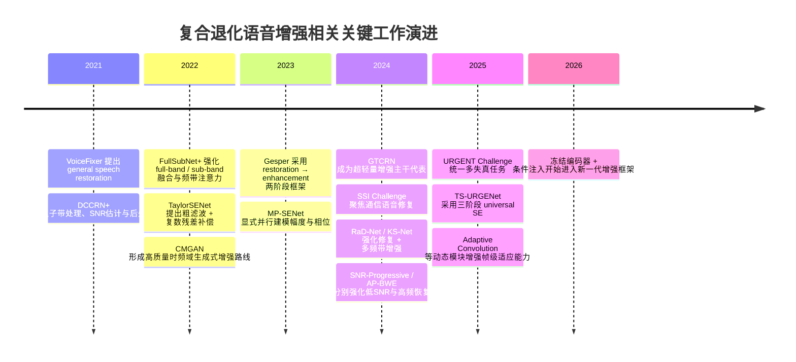

# 面向复合退化的显式退化建模与条件化频带残差语音增强方法研究现状与创新性评估报告

## 执行摘要

本报告围绕“面向复合退化的显式退化建模与条件化频带残差语音增强方法（EDCR-Net）”展开调研，重点考察其在近五年语音增强、语音恢复、带宽扩展、复合失真修复与通用语音增强方向中的相对位置。综合检索结果表明，当前主流研究已经形成四条较清晰的技术路径：一是以 FullSubNet、CMGAN、MP-SENet、GTCRN 为代表的端到端通用增强主干；二是以 DCCRN+、噪声分类辅助增强、SNR 渐进增强为代表的“条件/状态感知”增强；三是以 VoiceFixer、Gesper、RaD-Net、KS-Net、TS-URGENet 为代表的多阶段恢复—增强框架；四是以 AP-BWE、FullSubNet+ 等为代表的频带选择性建模与高频恢复路线。总体上，**“多阶段”“频带建模”“残差修复”“单一退化条件建模”这些部件并不新，但“从冻结轻量增强主干的瓶颈统计中显式联合估计多种复合退化因子，并据此进行受限、轻量、频带选择性的条件残差修复”这一组合，在公开文献中仍较少见**。citeturn15academia2turn24academia3turn2academia0turn16academia3turn10academia0turn6view0turn1academia2turn8academia1turn8academia0turn14academia2

从你当前系统说明来看，EDCR-Net建立在**冻结 GTCRN**之上，先由基础增强器得到 `enhanced_base` 与 `dpgrnn2` 瓶颈统计，再由退化估计器联合预测噪声存在性、SNR、带宽类别与量化位深，最后用条件嵌入驱动轻量残差模块，在频谱域完成受控补偿；整个附加链路仅增加约 4,169 个参数，而 GTCRN 官方实现本身约为 48.2K 参数、33 MMAC/s。这个设计使 EDCR-Net 的研究价值不在于“再接一个后处理模块”，而在于把**复合退化诊断**、**轻量条件修复**与**主干冻结**三者系统地绑在一起。fileciteturn0file0 citeturn6view0

在创新性评分上，我给 EDCR-Net 当前方案 **7.8/10**。评分理由是：它明显高于常规“GTCRN+Residual”式增量改进，因为它引入了显式退化建模、多任务诊断、轻量条件补偿和冻结主干的工程—学术统一框架；但它又尚未达到“9分以上”的程度，因为多阶段恢复、频带选择性建模、SNR/噪声辅助建模、高频加权损失等关键思想在现有文献中均已有先例，EDCR-Net 的真正新意主要体现在**组合方式、对象场景和可解释训练闭环**上，而不是每个单元模块都绝对原创。citeturn14academia3turn14academia2turn8academia0turn16academia1turn3academia2

## 背景与问题定义

近年的语音增强研究已经明显从“单一加性噪声抑制”扩展到“通用语音恢复/通用语音增强”。VoiceFixer 明确提出 **general speech restoration**，把加性噪声、混响、低分辨率与削波等多种失真统一起来；ICASSP 2024 SSI Challenge 则把通信系统中的语音信号改善作为核心场景；URGENT Challenge 进一步把去噪、去混响、带宽扩展、去削波放进统一评测框架，并强调 universality、robustness 与 generalizability。也就是说，**复合退化和跨任务统一建模已经是学术界明确成立的问题，不再是边缘命题**。citeturn15academia2turn8academia3turn14academia3

但现有方法仍主要分布在两端：一端是强大的端到端增强网络，擅长从退化语音直接映射到清洁语音；另一端是面向某一类具体失真单独设计的恢复器，如带宽扩展或低 SNR 优化器。前者缺点在于**对不同退化采用统一恢复策略**，常常缺乏明确的“当前输入究竟坏在哪里”的解释；后者缺点在于**只覆盖某一类退化**，难以自然扩展到“窄带+量化+噪声”等通信复合场景。DCCRN+ 在结构中引入了 a priori SNR estimation 和后处理，SNR-Progressive 则针对低 SNR 环境设计渐进增强与谐波补偿，但它们仍主要围绕噪声强度这一维度展开；VoiceFixer、Gesper、RaD-Net、KS-Net、TS-URGENet 能处理更复杂失真，但大多并不显式输出“噪声/SNR/带宽/位深”这类可解释诊断因子。citeturn24academia3turn16academia1turn15academia2turn1academia2turn8academia1turn8academia0turn14academia2

EDCR-Net 当前设计正是针对这个缺口：它不是重新训练一个更大的全新增强器，而是把问题分成“**基础增强**”与“**退化感知残余修复**”两个层次。按照当前项目说明，输入干净语音先经复合退化合成，再送入 **Frozen GTCRN** 得到基础增强频谱；随后从 `dpgrnn2` 瓶颈统计经退化估计器获得四个退化预测头；最后由 Adaptive Residual Module 对基础增强结果进行条件化残差修复。该系统明确把研究问题定义为：**基础增强之后仍残留的频谱错误，能否通过显式退化状态估计与频带选择性残差注入得到更有针对性的修复，同时保持基础主干能力不被破坏**。fileciteturn0file0

下面这张简化流程图可概括 EDCR-Net 当前工作对象与逻辑：

```text
Composite-degraded speech
        │
       STFT
        │
   Frozen GTCRN
   ├── enhanced_base
   └── bottleneck stats
            │
   Degradation Estimator
   ├── noise_present
   ├── snr_pred
   ├── bandwidth_class
   └── bitdepth_class
            │
     condition embedding
            │
 Adaptive Residual Module
   ├── band-aware gating
   └── residual correction
            │
 enhanced_final = base + gated_residual
            │
          iSTFT
```

这一问题设定与 GTCRN 官方定位也是一致的：GTCRN本身是一种超轻量通用语音增强主干，主打低参数量和低计算量，但并未显式区分不同退化类型。EDCR-Net 的研究意义，正是在不破坏 Ultra-lightweight Backbone 优势的前提下，把“退化诊断—修复策略”这条链条补上。fileciteturn0file0 citeturn6view0

## 检索策略与优先来源

本次调研采用“**问题—主题—代表作**”三层检索法。数据库优先使用 **Google Scholar、IEEE Xplore、arXiv、ACL Anthology**；来源优先级按 **ICASSP / Interspeech / ICLR / NeurIPS / ICML / IEEE TASLP / IEEE/ACM TASLP / arXiv 原始论文 / 官方实现仓库** 排列。最终重点纳入的文献，优先满足以下条件：与语音增强、语音恢复、带宽扩展、复合失真修复、条件化增强、多阶段增强、轻量增强直接相关；发布时间以近五年为主，必要时追溯到 2021 年以覆盖通用语音恢复与条件增强起点。citeturn14academia3turn8academia3turn15academia2

本次实际使用的检索关键词包括但不限于：  
**中文**：“复合退化 语音增强”“显式退化建模 语音增强”“带宽扩展 量化失真 噪声 语音恢复”“冻结主干 残差修复 语音增强”“频带选择性 语音增强”“通用语音增强”。  
**英文**：“composite degradation speech enhancement”“degradation-aware speech enhancement”“general speech restoration”“bandwidth extension codec artifacts speech enhancement”“SNR estimation speech enhancement”“noise classification aided speech enhancement”“two-stage speech restoration enhancement”“frozen backbone speech enhancement”“residual refinement speech enhancement”“band-selective speech enhancement”。这些关键词最终主要命中 GTCRN、VoiceFixer、DCCRN+、FullSubNet+、TaylorSENet、CMGAN、MP-SENet、Gesper、RaD-Net、KS-Net、AP-BWE、URGENT、TS-URGENet 等代表性工作。citeturn6view0turn15academia2turn24academia3turn2academia0turn16academia3turn15academia1turn10academia0turn1academia2turn8academia1turn8academia0turn9academia2turn14academia3turn14academia2

检索后，文献被按四个主题归档。第一类是**通用增强主干**，主要回答“基础增强器怎样做”；第二类是**条件/状态感知增强**，主要回答“是否显式利用噪声类型、SNR、环境或其他退化信息”；第三类是**多阶段恢复—增强**，主要回答“是否把修复拆为粗恢复与细增强两个过程”；第四类是**频带选择性与高频恢复**，主要回答“是否针对特定频带做重点建模”。EDCR-Net 与现有工作的创新性，恰好落在这四类交叉处，而非任何单一方向。citeturn2academia0turn16academia3turn24academia3turn15academia2turn1academia2turn8academia0turn9academia2

## 近五年相关工作综述

从时间上看，2021—2022 年的代表作更多是在“**增强主干更强**”与“**频带/残差/相位建模更细**”两个方向推进。FullSubNet 与 FullSubNet+ 把 full-band 与 sub-band 融合起来，并引入多尺度通道注意力以更关注判别性频带；CMGAN 把 Conformer 与 Metric-GAN 结合，走时频域高质量生成路线；TaylorSENet 则把增强过程解释为粗滤波加高阶复数残差补偿，显著提升了残差修复的可解释性；DCCRN+ 进一步把 sub-band、SNR estimation 与后处理揉在一起。这一阶段已经出现了 EDCR-Net 将会用到的几个关键部件原型：**频带建模、残差修复、状态辅助、后处理模块**，但这些工作大多仍是端到端统一优化，而不是“冻结基础增强器后，在其上做显式退化诊断和轻量条件补偿”。citeturn23view0turn15academia1turn16academia3turn24academia3

2021—2023 年还出现了另一条重要路线，即“**一般语音恢复**”与“**多阶段恢复—增强**”。VoiceFixer 率先把噪声、混响、低分辨率与削波放到 general speech restoration 框架里，说明学界已意识到“单任务语音增强”不足以应对真实失真；随后 Gesper 在 SSI 2023 中采用 restoration→enhancement 两阶段结构，RaD-Net 与 KS-Net 在 SSI 2024 中继续强化 repair/restore 与 multi-band enhancement 的分工。这些方法和 EDCR-Net 一样，都承认“先得到一个可用的粗结果，再做针对性修复”是有效思路；但它们通常没有把“**具体是哪一类复合退化导致了当前残差**”这一因素显式拆出来，更少见“联合预测噪声存在、SNR、带宽、位深”这样的可解释头。citeturn15academia2turn1academia2turn8academia1turn8academia0turn8academia3

到了 2023—2025 年，研究问题进一步从“增强”走向“**通用、多失真、跨域泛化**”。MP-SENet 强调对幅度与相位的显式并行估计，并把带宽扩展也纳入任务范围；AP-BWE 等工作则专门面向高频恢复和窄带到宽带重建；URGENT Challenge 把 denoising、dereverberation、bandwidth extension、declipping 统一起来，TS-URGENet、USEMamba、FUSE 等系统都开始用多阶段或混合范式处理异构失真。这意味着 EDCR-Net 选择“复合退化”作为论文第二创新点是顺势而为，而不是逆势命题；真正决定创新性高低的，将不再是“能不能做复合退化”，而是“**如何比已有 universal / multi-stage 系统更可解释、更轻量、更易部署**”。citeturn10academia0turn9academia2turn14academia3turn14academia2turn14academia0turn14academia1

近两年的一条补充趋势是：研究者开始尝试**冻结预训练或外部主干，只学习轻量条件模块**。例如最近的 Wav2Vec2-conditioned 语音增强工作使用冻结的 wav2vec 2.0 编码器，再在扩散模型瓶颈上用 FiLM 做条件注入；LaDen 则把测试时自适应用于跨域增强。与之相比，EDCR-Net 的价值不在“冻结”本身，而在于冻结的是一个**可部署的轻量增强器主干**，条件信号也不是抽象 SSL 表征，而是与通信复合退化直接对应的噪声/SNR/带宽/位深诊断，这使其解释性和边缘部署意义更强。citeturn17academia1turn7academia0turn6view0turn0file0

下图概括了与 EDCR-Net 最相关的关键工作演进。时间线中的节点覆盖了“通用恢复”“频带建模”“显式状态辅助”“多阶段修复”“通用复合失真增强”等几条路线。其直接含义是：**EDCR-Net 的最佳定位，不是宣称提出了全新方向，而是宣称在这些已存在但分散的方向交叉处，形成了一种更轻量、更可解释、面向通信复合退化的统一实现。** citeturn15academia2turn24academia3turn23view0turn16academia3turn15academia1turn1academia2turn10academia0turn6view0turn8academia1turn8academia0turn16academia1turn9academia2turn14academia3turn14academia2



## 按主题分类的代表性文献表

下表选取了与 EDCR-Net 最相关、且能够覆盖“显式退化建模”“条件残差/频带选择性”“冻结主干/两阶段”三条比较轴的代表性论文。需要强调的是，表中的“是否显式退化建模”采用严格标准：只有当方法明确使用噪声类型、SNR、带宽、位深或等价可解释状态量时，才记为“是”；仅针对某类任务设计网络结构但不输出或使用显式状态标签的，记为“否”或“部分”。这个标准对 EDCR-Net 很关键，因为它直接关系到你论文中“显式退化建模”四个字是否站得住。citeturn24academia3turn12academia3turn16academia1turn14academia2turn0file0

| 论文名 | 作者 | 年份 | 会议/期刊 | 方法要点 | 显式退化建模 | 条件残差/频带选择性 | 冻结主干/两阶段 | 主要指标与数据集 |
|---|---|---:|---|---|---|---|---|---|
| DCCRN+: Channel-wise Subband DCCRN with SNR Estimation for Speech Enhancement citeturn24academia3 | Lv 等 | 2021 | arXiv / DNS Challenge 相关 | 子带处理、a priori SNR estimation、后处理模块 | **部分**（SNR） | **部分**（子带 + post-processing） | **部分**（后处理） | PESQ、DNSMOS；DNS Challenge |
| VoiceFixer: Toward General Speech Restoration with Neural Vocoder citeturn15academia2turn22view0 | Liu 等 | 2021 | arXiv | general speech restoration；analysis + vocoder synthesis 两阶段 | 否 | 否 | **是**（两阶段） | MOS；加性噪声、混响、低分辨率、削波 |
| Noise Classification Aided Attention-Based Neural Network for Monaural Speech Enhancement citeturn12academia3 | Ma 等 | 2021 | arXiv | 噪声分类嵌入引导注意力增强泛化 | **是**（噪声类型） | **部分**（条件注意力） | 否 | PESQ；单通道语音增强实验 |
| FullSubNet+: Channel Attention FullSubNet with Complex Spectrograms for Speech Enhancement citeturn2academia0turn23view0 | Chen 等 | 2022 | arXiv | 全带/子带融合，多尺度通道注意力聚焦判别性频带 | 否 | **是**（频带选择性） | 否 | DNS 指标；DNS Challenge 数据 |
| Taylor, Can You Hear Me Now? A Taylor-Unfolding Framework for Monaural Speech Enhancement citeturn16academia3turn23view2 | Li 等 | 2022 | IJCAI | 粗滤波 + 高阶复数残差，强调残差解释性 | 否 | **是**（显式残差） | 否 | 多指标；两个基准集 |
| CMGAN: Conformer-based Metric GAN for Speech Enhancement citeturn15academia1turn25academia3 | Cao, Abdulatif, Yang | 2022 | Interspeech / arXiv | 时频域 Conformer + MetricGAN，高质量感知优化 | 否 | 否 | 否 | PESQ、SSNR；VoiceBank+DEMAND |
| Gesper: A Restoration-Enhancement Framework for General Speech Reconstruction citeturn1academia2 | Liu 等 | 2023 | arXiv / SSI 系统论文 | restoration → enhancement 两阶段； fullband-wideband parallel 增强 | 否 | **部分**（并行频带处理） | **是**（两阶段） | P.804 MOS、P.835 MOS；SSI blind test |
| MP-SENet: A Speech Enhancement Model with Parallel Denoising of Magnitude and Phase Spectra citeturn10academia0turn10academia1 | Lu, Ai, Ling | 2023 | arXiv | 幅度与相位并行显式估计，统一多级损失 | 否 | 否 | 否 | PESQ 等；多任务含去噪、去混响、BWE |
| GTCRN: A Speech Enhancement Model Requiring Ultralow Computational Resources citeturn6view0 | Rong 等 | 2024 | ICASSP / 官方实现 | 48.2K 参数、33 MMAC/s 的超轻量增强器 | 否 | 否 | 否 | VCTK-DEMAND：SI-SNR/PESQ/STOI；DNS3：DNSMOS |
| RaD-Net: A Repairing and Denoising Network for Speech Signal Improvement citeturn8academia1 | Liu 等 | 2024 | arXiv / SSI 系统论文 | 修复 + 去噪两阶段；多分辨率与多频带判别器；三步训练 | 否 | **部分**（多频带判别） | **是**（两阶段） | SSI 排名；P.804/WAcc |
| KS-Net: Multi-band Joint Speech Restoration and Enhancement Network for 2024 ICASSP SSI Challenge citeturn8academia0 | Yu 等 | 2024 | arXiv / SSI 系统论文 | 复域 GAN restoration + fine-grained multi-band fusion enhancement | 否 | **是**（多频带融合） | **是**（两阶段） | P.804 MOS、WAcc；SSI blind test |
| SNR-Progressive Model with Harmonic Compensation for Low-SNR Speech Enhancement citeturn16academia1 | Hou 等 | 2024 | arXiv / Letter | 面向低 SNR 的渐进增强，结合谐波补偿与中间可靠音高估计 | **部分**（SNR regime） | **部分**（谐波补偿） | **部分**（渐进式） | 低 SNR 指标；MISP 相关实验 |
| Towards High-Quality and Efficient Speech Bandwidth Extension with Parallel Amplitude and Phase Prediction citeturn9academia2 | Lu, Ai, Du, Ling | 2024 | arXiv | 双流幅度/相位高频恢复，专注带宽扩展 | 否 | **是**（高频恢复） | 否 | BWE 质量、效率；16k/48k BWE 任务 |
| URGENT Challenge: Universality, Robustness, and Generalizability For Speech Enhancement citeturn14academia3 | Zhang 等 | 2024 | arXiv / Challenge | 统一 denoising、dereverb、BWE、declipping；12 项指标 | 否 | 否 | 否 | 多语种、多失真、12 指标 |
| TS-URGENet: A Three-stage Universal Robust and Generalizable Speech Enhancement Network citeturn14academia2 | Rong 等 | 2025 | arXiv / URGENT 系统论文 | filling、separation、restoration 三阶段，覆盖包丢失、噪声、混响、削波、带宽、codec artifact | **部分**（按失真类别分阶段） | **部分**（阶段选择性） | **是**（三阶段） | URGENT 排名；多任务统一评测 |

从表中可以看出，和 EDCR-Net 最近似的并不是某一篇单独论文，而是一类“交叉组合”方法群：DCCRN+ 证明了 SNR 这类显式状态量有助于增强；FullSubNet+、KS-Net、AP-BWE 证明了频带选择性建模对局部恢复有效；TaylorSENet 证明了残差修复本身可以成为有解释性的核心对象；Gesper、RaD-Net、TS-URGENet 证明了多阶段恢复—增强对复合失真是有效的。但把这几类思想同时落在**冻结轻量主干 + 多任务退化诊断 + 受控频带残差修复**上的公开方法，目前并不多见。citeturn24academia3turn2academia0turn8academia0turn9academia2turn16academia3turn1academia2turn8academia1turn14academia2turn0file0

## 与 EDCR-Net 的技术对比

若把 EDCR-Net 放进现有文献中比较，其最接近的不是“最佳端到端增强器”，而是“**针对通用基础增强器的显式、轻量、可解释的残余修复框架**”。按当前设计，EDCR-Net 的结构可概括为：**Frozen GTCRN + Degradation Estimator + Adaptive Residual Module**。其中退化估计器从 `dpgrnn2 bottleneck stats` 得到 32 维统计特征，输出噪声存在、SNR、带宽类别、量化位深四类条件；残差模块再根据 9 维条件向量生成条件嵌入、频域卷积残差与门控补偿，最后在频谱域执行 `enhanced_final = enhanced_base + α·residual`。这一结构和现有工作的核心差异是：GTCRN、CMGAN、MP-SENet、FullSubNet+ 等更像“**一个网络直接学完整清洁映射**”；而 EDCR-Net 更像“**一个网络先做通用恢复，另一个很小的解释性模块专门修补剩余误差**”。fileciteturn0file0 citeturn6view0turn15academia1turn10academia0turn2academia0

在损失设计上，EDCR-Net 当前采用两条损失链：退化估计器使用 **BCE + masked SNR regression + 两个 Cross-Entropy**；残差增强器使用 **全频带幅度损失 + 高频附加损失 + 残差正则项**。这与 MP-SENet 的多级幅相联合损失、CMGAN 的度量/对抗驱动、TaylorSENet 的结构化残差建模相比，明显更偏“**诊断驱动的小修正**”而不是“直接追求输出极限上界”。这种设计的利点是解释性更强、训练更稳、增量参数极小；弱点是如果残差模块容量不足，或者条件变量的信息熵过低，就容易成为“有标签但修不动”的后处理器。换言之，EDCR-Net 的成败不取决于损失写得多复杂，而取决于**四个预测头是否真的与残差分布相关**。fileciteturn0file0 citeturn10academia0turn15academia1turn16academia3

在训练策略上，EDCR-Net 的分阶段训练思路与 Gesper、RaD-Net、TS-URGENet 等多阶段方法存在家族相似性，但又更“保守”：它不重新优化整条增强主干，而是先缓存 GTCRN 瓶颈统计、训练退化估计器，再训练自适应残差模块，并允许保持 GTCRN 持续冻结。已有两阶段或三阶段系统通常强调性能极限，而 EDCR-Net 的路线更接近**能力保持 + 低风险增量**；这在硕士论文和工程部署场景里反而是优势，因为它更容易证明“不是靠把 backbone 改成更大的模型取胜”。fileciteturn0file0 citeturn1academia2turn8academia1turn14academia2

在可解释性上，EDCR-Net 相比 GTCRN、CMGAN、MP-SENet 这类黑箱主干，最大的优势是具有**显式可输出的退化因子**和**可可视化的门控强度**。相较之下，DCCRN+ 的 SNR estimation、噪声分类辅助增强的噪声类别嵌入、SNR-progressive 的低 SNR 渐进设计，都只覆盖单一或少数状态变量；EDCR-Net 若能把四个头的预测与频带残差热图配对展示，就会在“方法是否真的根据退化状态进行决策”这个问题上形成更强论证。这里的关键不是“有四个头”，而是“**四个头必须改变网络行为**”。如果最终 α 只是一个全局标量，而高频残差又只做固定频段修复，那么“显式退化建模”的学术力度会明显下降。citeturn24academia3turn12academia3turn16academia1turn0file0

在泛化性上，EDCR-Net 理论上有两面性。一方面，冻结 GTCRN、把补偿范围限制在 4,169 个附加参数之内，有助于降低灾难性遗忘，并保留轻量主干在 VCTK-DEMAND / DNS3 这类标准数据上的既有能力；另一方面，如果退化估计器完全依赖合成标签并且训练退化组合过于规则，它也可能学习到“数据生成器偏差”而不是“真实退化规律”。因此，EDCR-Net 的泛化优势并不自动成立，必须通过 URGENT/SSI 式 unseen distortions、顺序打乱、Oracle labels 与 predicted labels 对照实验来证实。这个风险在一切显式诊断系统里都存在，只是 EDCR-Net 因为强调“显式建模”，会被评审问得更细。citeturn6view0turn14academia3turn8academia3turn0file0

## 创新性评估、改进建议与实验清单

综合现有文献，我认为 EDCR-Net 的**真正新颖点**主要有四个。第一，**从冻结轻量增强主干的瓶颈统计中做联合多因子退化估计**，这一点与 DCCRN+ 的 SNR 模块、噪声分类辅助增强的噪声类型嵌入、SNR-progressive 的低 SNR 专项处理相比，覆盖面更广，也更接近通信语音中的复合退化表征。第二，**退化估计不是为了分析而分析，而是直接驱动条件残差修复**，这比单纯做辅助分类更有方法学价值。第三，**只在基础增强之后做轻量受控修复而不改动 backbone**，使方法兼顾可部署性、解释性和参数效率。第四，若你进一步把当前 V2 分频带处理升级为真正的 band-wise 或 time-frequency gate，方法就会在“显式退化建模 + 频带条件修复”这一交叉点上形成更强差异化。citeturn24academia3turn12academia3turn16academia1turn0file0turn6view0

同时，也必须诚实指出 **哪些点已经被覆盖了**。多阶段恢复—增强并不新，VoiceFixer、Gesper、RaD-Net、KS-Net、TS-URGENet 都说明“先粗恢复再细修复”是成熟思路；频带选择性也不新，FullSubNet+、KS-Net、AP-BWE 都在不同层面处理了频带/高频重点建模；残差修复本身也不新，TaylorSENet 已经给出强解释性残差框架；状态辅助增强也不新，DCCRN+、噪声分类辅助增强、SNR-progressive 都证明单一状态变量是有效的。因此，EDCR-Net 不宜把创新表述成“首次提出多阶段/频带/残差/状态感知增强”，而应表述为：**首次或较早地把多因子显式退化诊断、冻结轻量主干与条件化频带残差修复统一成面向通信复合退化的轻量框架**。citeturn15academia2turn1academia2turn8academia1turn8academia0turn14academia2turn2academia0turn9academia2turn16academia3turn24academia3turn12academia3turn16academia1

我给 EDCR-Net 的创新性评分是 **7.8/10**。如果从论文评价语言来说，这个分数意味着：**作为硕士学位论文第二创新点，已经具备“成立且值得写成完整章节”的强度；作为顶会论文的核心单点创新，还需要更强的差异化机制与更扎实的 unseen degradation 证据。** 扣分主要来自三点：一是当前公开思路还偏“分类器 + residual block”的工程表述；二是四个退化预测头与补偿行为之间的结构绑定仍可更强；三是如果实验只停留在合成复合退化而没有更强泛化验证，容易被评价为“系统集成优于方法创新”。相应地，若你把 band-wise experts、Oracle vs predicted labels、unseen codec/packet loss/real communication channels、退化顺序随机化、门控热图解释演示补齐，我会把评分上调到 **8.3—8.6/10**。citeturn14academia3turn8academia3turn14academia2turn7academia0turn0file0

建议的改进方向有五条。第一，把当前可能偏全局的 α 扩展成**分频带门控**，最好进一步走到 **time-frequency gate**，这是从“条件残差”升级到“条件频带残差”的关键。第二，用**多专家残差分支**替代单一残差卷积，例如噪声残留专家、带宽缺失专家、量化失真专家，各自由退化嵌入加权，这会显著强化“显式退化建模”的结构实义。第三，在带宽与位深头上增加**连续回归目标**，例如 cutoff frequency 与 effective bit depth，从而降低纯分类头对离散档位的过拟合。第四，把当前高频附加损失扩展成**条件化频带损失**，并结合近期强调感知频率权重的损失思想，避免模型只把高频当作固定重点，而忽略量化失真可能带来的全频纹理损伤。第五，引入轻量的**测试时适配或域不变蒸馏策略**，以提升跨设备、跨语言、跨录制链路的鲁棒性。citeturn2academia0turn8academia0turn16academia3turn9academia2turn3academia2turn7academia0turn13academia2

必须做的对比实验与消融，建议至少包括以下八类。其一，**基础基线对照**：Frozen GTCRN、GTCRN+普通 residual、GTCRN+EDCR-Net。其二，**条件有效性对照**：真实退化标签驱动的 Oracle EDCR-Net 与预测标签驱动的实际 EDCR-Net。其三，**每个退化头的独立消融**：去掉 noise、SNR、bandwidth、bit-depth 任一头。其四，**特征来源消融**：原始 STFT 统计、浅层编码器特征、dpgrnn1、dpgrnn2、多层拼接。其五，**门控粒度消融**：全局标量 α、分频带 α、time-frequency gate。其六，**训练策略消融**：冻结估计器、联合微调估计器、解冻 backbone。其七，**泛化评估**：未见噪声、未见编码器、未见比特率、退化顺序打乱、真实通信链路录音。其八，**解释性评估**：退化头准确率/MAE、门控热图、残差能量比、HF-LSD、band-wise LSD。没有这组实验，EDCR-Net 的创新主张很难完全站稳。citeturn6view0turn14academia3turn8academia3turn8academia0turn16academia3turn0file0

可直接用于论文“相关工作与创新性论证”的结论可表述为：**现有研究已分别验证了通用增强主干、多阶段恢复—增强、频带选择性修复以及单因素状态感知的有效性，但对于通信复合退化场景，公开文献中仍缺少一种同时兼顾超轻量基础主干、显式多因子退化建模、条件化频带残差修复与冻结式增量训练的统一框架。EDCR-Net 的创新性不在于单个模块孤立新颖，而在于以明确的问题链条把这些技术要素组织为一个可解释、轻量、可部署且面向复合退化的完整方法。** citeturn15academia2turn24academia3turn2academia0turn16academia3turn1academia2turn8academia0turn14academia2turn6view0turn0file0

可优先引用的关键参考文献与官方实现如下。  
**GTCRN**：官方实现与论文入口见 GTCRN GitHub。citeturn6view0  
**VoiceFixer**：General Speech Restoration 原始论文与官方仓库。citeturn15academia2turn22view0  
**FullSubNet / FullSubNet+**：FullSubNet 官方实现，以及 FullSubNet+ 频带注意力扩展。citeturn23view0turn2academia0  
**TaylorSENet**：残差修复最接近 EDCR 方法思想的代表作之一，附官方实现。citeturn16academia3turn23view2  
**CMGAN**：高质量时频域生成增强强基线。citeturn15academia1turn25academia3  
**DCCRN+**：SNR estimation 与子带后处理代表。citeturn24academia3  
**Gesper、RaD-Net、KS-Net**：两阶段复合失真恢复—增强路线。citeturn1academia2turn8academia1turn8academia0  
**AP-BWE 与 SNR-Progressive**：分别对应高频恢复与低 SNR 专项条件建模。citeturn9academia2turn16academia1  
**URGENT Challenge 与 TS-URGENet**：当前“多失真统一增强”最直接的参照系。citeturn14academia3turn14academia2